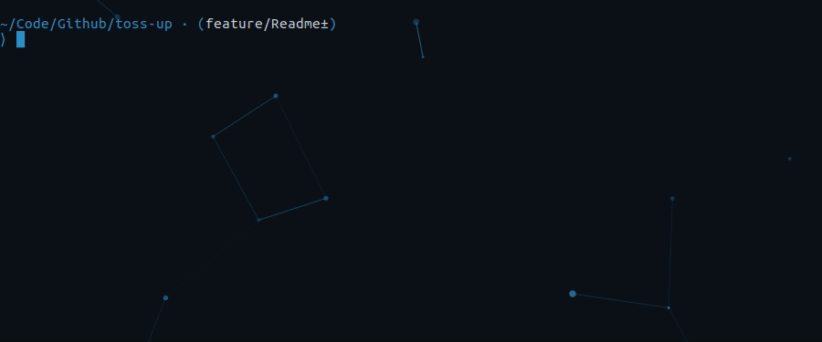

## toss-up
Decentralized betting platform using Chainlink randomness & React frontend. The betting system is a decentralized Smartcontract deployed to an Ethereum test network (Rikeby) for transparency & immutability. Application assets are stored on the Interplanetary FileSystem (IPFS) for censorship resistance. Chainlink is being used by the contract as an oricle to generate randomness and determine ETH price at the time of transaction.

#### Issues

- [x] [Initialize React App & Setup](https://github.com/MBrassey/toss-up/issues/1)
- [x] [Deploy Smartcontract to Rinkeby Test Network ](https://github.com/MBrassey/toss-up/issues/2)
- [x] [React/Web3 Components](https://github.com/MBrassey/toss-up/issues/3)
- [x] [Stylize & Test](https://github.com/MBrassey/toss-up/issues/4)
- [x] [Create Readme & Deploy to IPFS](https://github.com/MBrassey/toss-up/issues/5)

#### Table of Contents

* [Ethereum](#Ethereum)
* [IPFS](#IPFS)
* [Chainlink](#Chainlink)
* [Requirements](#Requirements)
* [Installation](#Installation)
* [Usage](#Usage)
* [Preview](#Preview)
* [Questions](#Questions)
* [License](#License)

#### Ethereum

The TossUp Smartcontract is deployed live on the Rinkeby testnet: [0x37465edC8...](https://rinkeby.etherscan.io/address/0x37465edc8d70e4b16033fae23088b1c703924a80).

#### IPFS

    coming soon

#### Chainlink

    coming soon

#### Requirements

    node
    npm

#### Installation

    npm i

#### Usage

    npm run start
    npm run test a (optional)
    browse: localhost:3001/

<h6>
:cyclone: Click the image(s) below to view the live <a id="Preview" href="https://brassey.io/">webapplication</a>
</h6>

> Application Preview
> 

> Bet
> 

> Testing with Jest
> 

#### Questions

Contact me at [matt@brassey.io](mailto:matt@brassey.io) with any questions or comments.

#### License

`toss-up` is published under the **CC0_1.0_Universal** license.

> The Creative Commons CC0 Public Domain Dedication waives copyright interest in a work you've created and dedicates it to the world-wide public domain. Use CC0 to opt out of copyright entirely and ensure your work has the widest reach. As with the Unlicense and typical software licenses, CC0 disclaims warranties. CC0 is very similar to the Unlicense.

